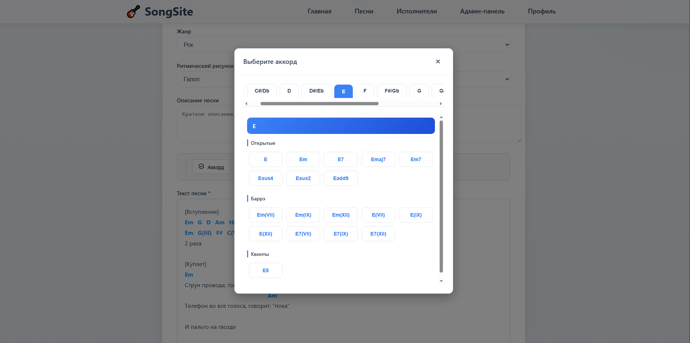

# Song Editor 🎵

A feature-rich demo application for musicians and songwriters to manage song lyrics with chords. Users can create, edit, and search songs, with full user authentication and cloud deployment.


## 📸 Screenshots

### Song Writing Interface

*Create and edit songs with an intuitive chord selection menu. Add chords above lyrics, choose from common chord types, and see real-time preview of your work.*

## ✨ Key Features

### 🎸 Song Management
*   **Add Songs**: Create original song lyrics with musical chord annotations
*   **Smart Search**: Search through existing songs in the database
*   **Rich Text Editing**: Format lyrics and add chords above words
*   **Chord Selection Menu**: Easy-to-use dropdown menu with common chords (C, G, Am, F, etc.)
*   **Visual Preview**: See how chords align with lyrics in real-time

### 🔐 User System
*   **User Registration**: Create a personal account to save your songs
*   **Email Verification**: Secure account activation via email confirmation
*   **Google Authentication**: One-click login with Google OAuth 2.0
*   **Profile Management**: Manage your personal song collection

### ☁️ Cloud Integration
*   **Persistent Storage**: All songs and user data stored in the cloud
*   **Cross-Device Access**: Access your songs from anywhere
*   **Real-time Updates**: Changes sync automatically

## 🛠️ Tech Stack

### Frontend
*   **Framework**: Vanilla JavaScript with modern ES6+ features
*   **Styling**: Custom CSS with responsive design
*   **Deployment**: [Netlify](https://www.netlify.com/) - Continuous deployment from GitHub

### Backend & Infrastructure
*   **API Server**: Node.js/Express hosted on [Render.com](https://render.com/)
*   **Database**: [Supabase](https://supabase.com/) - PostgreSQL with real-time capabilities
*   **Authentication**: 
    *   Supabase Auth for email/password registration
    *   Google OAuth 2.0 integration
    *   JWT token-based session management
*   **Email Service**: Supabase built-in email verification

## 🚀 Live Demo

The application is live and accessible at: **[song-editor.netlify.app](https://song-editor.netlify.app)** (update with your actual URL)

## 📋 Prerequisites

*   Node.js (v14 or higher)
*   npm or yarn
*   A Supabase account (for database)
*   Google Cloud Console account (for OAuth)

## 🏗️ Local Development Setup

1.  **Clone the repository**
    ```bash
    git clone https://github.com/codeinveins123/song-editor.git
    cd song-editor
    ```

2. **Install Dependencies**
```bash
# Install root dependencies
npm install

# Client setup
cd client
npm install

# Server setup
cd ../server
npm install
```

3. **Run Locally**
```bash
# From root directory (Windows)
./run.bat

# Or manually:
# Terminal 1 (Server)
cd server && npm start

# Terminal 2 (Client)
cd client && npm start
```
Access the app at http://localhost:3000

## 🌐 Deployment Architecture
```
┌─────────────┐     ┌──────────────┐     ┌─────────────┐
│   Netlify   │────▶│   Render.com │────▶│  Supabase   │
│  (Frontend) │     │  (Backend)   │     │  (Database) │
└─────────────┘     └──────────────┘     └─────────────┘
       │                    │                    │
       ▼                    ▼                    ▼
  Static Files         API Server           PostgreSQL
   Auto-deploy         Auto-deploy          Auth System
   from GitHub         from GitHub         Real-time
```

## Deployment Details

| Component | Platform | Purpose | Configuration |
|------------|-----------|----------|---------------|
| Frontend | Netlify | Serves static files | netlify.toml with build settings |
| Backend API | Render.com | Handles requests | Web service with Node.js environment |
| Database | Supabase | Stores user/song data | PostgreSQL with Row Level Security |
| Authentication | Supabase Auth | Manages users | Email + Google OAuth providers |
| Email | Supabase | Verification emails | SMTP configuration |

## 📁 Project Structure
```
song-editor/
├── client/                    # Frontend application
│   ├── public/                # Static assets
│   │   └── photo1.png         # Demo screenshot
│   ├── src/                   # Source code
│   │   ├── components/        # UI components
│   │   ├── services/          # API integration
│   │   └── styles/            # CSS modules
│   └── package.json
├── server/                     # Backend API
│   ├── routes/                # API endpoints
│   ├── middleware/            # Auth middleware
│   ├── models/                # Database models
│   └── package.json
├── netlify.toml               # Netlify deployment config
├── render.yaml                 # Render.com deployment config
├── run.bat                     # Local development script
└── README.md
```

## 🔒 Security Features
* Row Level Security in Supabase ensures users can only access their own data
* JWT tokens for authenticated API requests
* Password hashing with bcrypt
* HTTPS enforced on all production endpoints
* CORS properly configured for API security
* Rate limiting on authentication endpoints

## 📝 API Endpoints

| Endpoint | Method | Description | Auth Required |
|-----------|--------|-------------|----------------|
| /api/auth/register | POST | Register new user | No |
| /api/auth/login | POST | Login with email/password | No |
| /api/auth/google | GET | Google OAuth initiation | No |
| /api/auth/verify | GET | Email verification | No |
| /api/songs | GET | Get user's songs | Yes |
| /api/songs | POST | Add new song | Yes |
| /api/songs/:id | PUT | Update song | Yes |
| /api/songs/:id | DELETE | Delete song | Yes |
| /api/search | GET | Search public songs | Optional |

## 🎹 Chord Selection Menu
The chord editor features an intuitive dropdown menu that allows you to:

* Select from common chords: Major, minor, seventh chords
* Quick insertion: Click to place chords above selected lyrics
* Visual feedback: See chord placement in real-time
* Edit mode: Easily modify or remove existing chords

See the screenshot above for a visual demonstration of this feature.

## 🤝 Contributing
Contributions are welcome! Please feel free to submit a Pull Request.

1. Fork the repository
2. Create your feature branch (`git checkout -b feature/AmazingFeature`)
3. Commit your changes (`git commit -m 'Add some AmazingFeature'`)
4. Push to the branch (`git push origin feature/AmazingFeature`)
5. Open a Pull Request

## 📄 License
This project is licensed under the MIT License - see the LICENSE file for details.

## 👥 Authors
**codeinveins123** - Initial work - [GitHub](https://github.com/codeinveins123)

## 🙏 Acknowledgments
* Supabase for amazing backend infrastructure
* Netlify for seamless frontend hosting
* Render.com for reliable backend deployment
* All contributors and users
